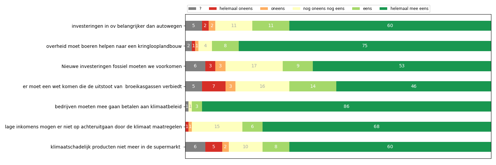

# Dashboard

## Introduction

Dashboard is a program developed by F.Feenstra

## Prerequisites  

The program requires the following packages to be installed:  

 * pandas ([V1.0.1](https://github.com/pandas-dev/pandas); [BSD 3-Clause License](https://github.com/pandas-dev/pandas/blob/master/LICENSE))  
 * matplotlib ([v3.1.3](https://github.com/matplotlib/matplotlib/releases/tag/v3.1.3); [PSF license](https://matplotlib.org/3.1.1/users/license.html))  
 * pyyaml ([V5.3](https://github.com/yaml/pyyaml); [Lisense](https://github.com/yaml/pyyaml/blob/master/LICENSE))


See 'Installing' on how to install these packages.

## Installing  

Installing and running the program can be done by executing the following steps:

**Step 1: acquire the source files**      
Either [clone](https://github.com/fenna/dashboard_OK.git) or [download](https://github.com/fenna/dashboard_OK) the source files.

**Step 2: creating the virtual environment**

*Alternative step below*     
1) Open JetBrains PyCharm  
2) Click on 'File' -> 'Settings' (Ctrl + Alt + S) -> 'Project: progr1' -> 'Project Interpreter'  
3) Add a new interperter by pressing the gear icon -> 'Add'  
4) Make sure 'New environment' is selected, click on 'OK' and again click on 'OK'  
5) Activate the virtual environment by either restarting PyCharm or executing the following command in the terminal:  
```console
source venv/bin/activate
```  

**Alternatively**

1) Open a terminal in the project root folder
2) Run: ```bash venv_installer.sh```  
3) Wait for bash script to complete installing the packages
4) Activate the virtual environment by restarting PyCharm or using
```console
source venv/bin/activate
```  

*Note: you can skip step 3 with this alternative method.*

**Step 3: installing the required packages**  
  
1) Make sure the virtual environment is active and run the command  
```console  
pip install -r requirements.txt
```  
2) Wait for the command to finish the installations  

**Step 4: running the program**  
  
Download a csv file from the hah.milieudefensie.nl dashboard to the projectfolder. 
Execute the following command in the command-line:  
```console  
python3 dashboard.py
``` 

## Functionality

### fill_array(df, colno)

Function to fill an array y with the numbers of occurrence per category. This function only processes one column. For instance 1 'weet niet', 2 'mee oneens' and 100 'helemaal eens' results in y = [1, 0, 2, 0, 0, 100]. These arrays are used to fill the horizontal bar in the chart

### survey(results, category_names)
This funtion creates the graph. It uses the following parameters:
    results : dict
        A mapping from question labels to a list of answers per category.
        It is assumed all lists contain the same number of entries and that
        it matches the length of *category_names*.
    category_names : list of str
        The category labels
The horizontal bar is grey for the 'weet niet' part and it does not display 0
see also 
https://matplotlib.org/gallery/lines_bars_and_markers/horizontal_barchart_distribution.html


### clean_file(f):
This function is necesarry to preprocess the file and to ignore empty values

### question_setlabels(df):
The column names of the tables generated by hah webapp are numbers. These need to 
be mapped with the 'stellingen' from the config file


## Usage  

The program can read multiple files and analyse them one by one in case no arguments are given. The files of the analysies need to be in the same directory of the dashboard.py
  
```console  
python3 dashboard.py
``` 

The program can read a single file by parsing a file argument:
  
```console  
python3 dashboard.py /path/to/directory/file.csv 
```
  
This program also requires a [config.yml](config.yml) file in which the user can alter the stellingen

## Output  

The program outputs a png file with the analysis for each csv file:  


### Example output

  

*Figure1: dashboard of gesprekken 2020 tot 04 february postcode-8900-8941,9700-9747*  


